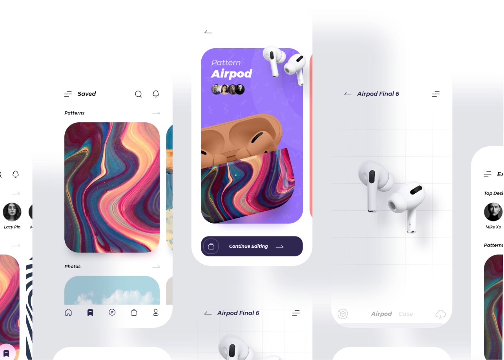
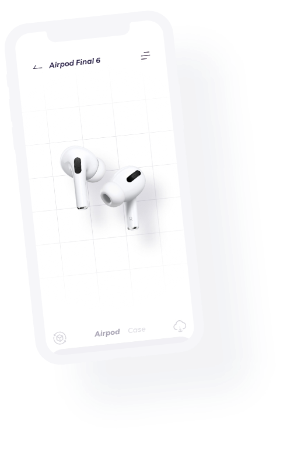

# Cases Template
 

## Tools: 
* CSS
    * [Bootstrap](https://getbootstrap.com/) 
        * [AOS](https://michalsnik.github.io/aos/)
            * [Venobox](https://veno.es/venobox/)
* JS
    * [AOS](https://michalsnik.github.io/aos/)
        * [Venobox](https://veno.es/venobox/)
* HTML
    * Structure

## Installation 🔧

#### Just unzip the .zip file and open it with your favorite code editor to be able to run.

## Thank you for choosing this template.🎁

* Tell others about this project 📢
* Invite me a coffee ☕ 
* If you want a personalized static website, I can gladly help you.😉

## Autor
* **Ismael Rosete** - *Cases* - [Lxrd17](https://github.com/Lxrd17)

 